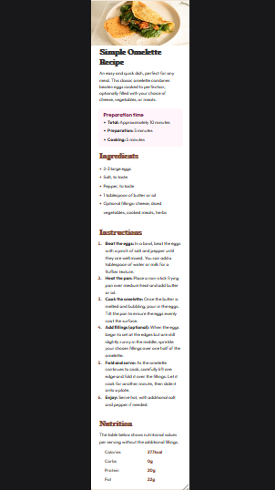
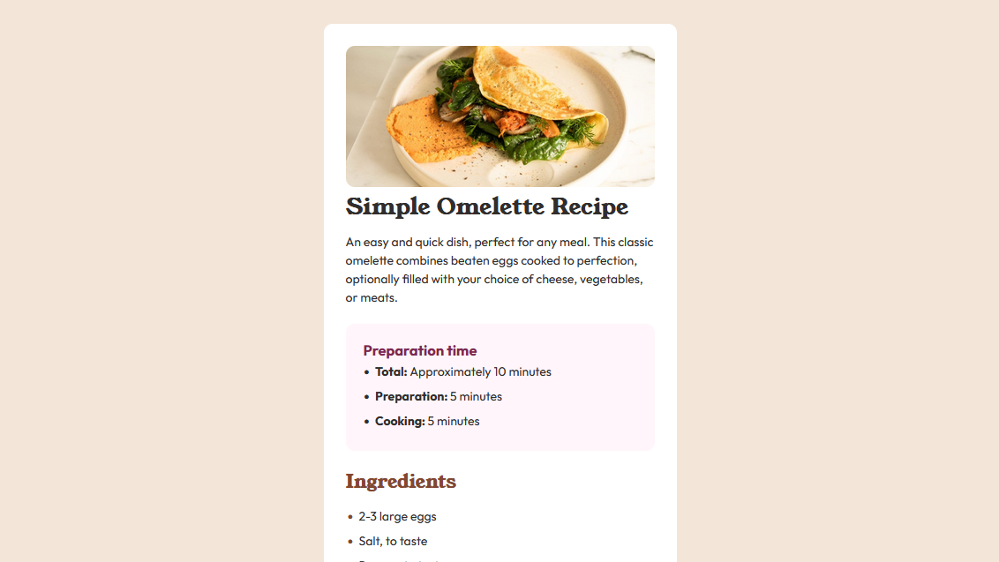
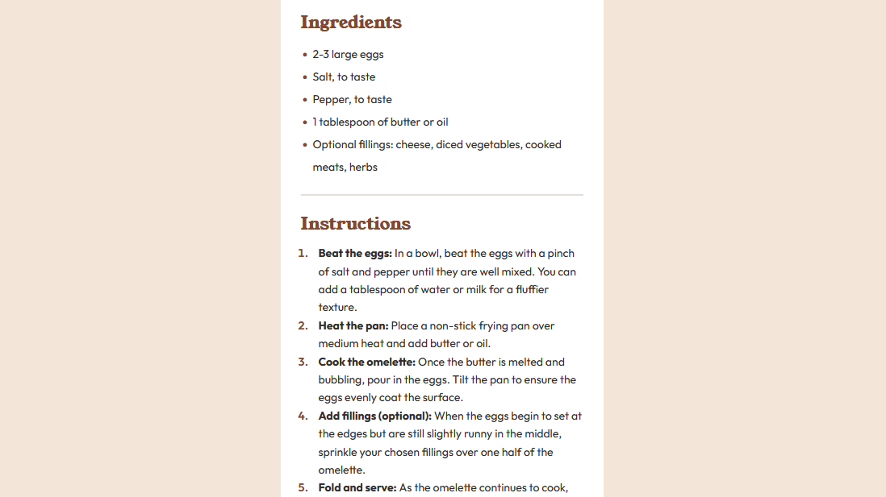
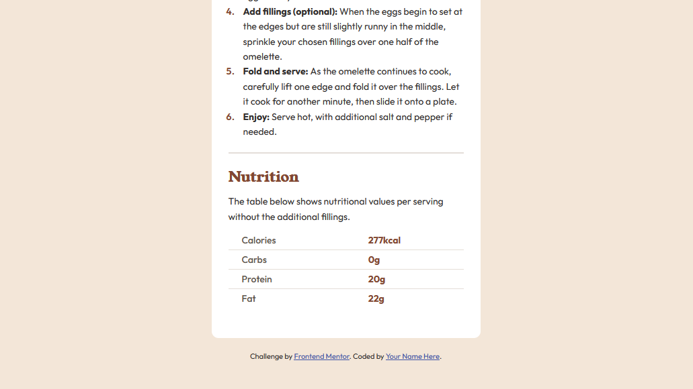

# Frontend Mentor - Recipe page solution

This is a solution to the [Recipe page challenge on Frontend Mentor](https://www.frontendmentor.io/challenges/recipe-page-KiTsR8QQKm). Frontend Mentor challenges help you improve your coding skills by building realistic projects.

## Table of contents

- [Overview](#overview)
  - [The challenge](#the-challenge)
  - [Screenshot](#screenshot)
  - [Links](#links)
- [My process](#my-process)
  - [Built with](#built-with)
  - [What I learned](#what-i-learned)
  - [Continued development](#continued-development)
  - [Useful resources](#useful-resources)
- [Author](#author)

## Overview

### Screenshot

-  - 
- 
- 

### Links

- Solution URL: [GitHub repo](https://github.com/sammie-create/recipe-page-main)
- Live Site URL: [live site URL](https://sammie-create.github.io/recipe-page-main)

## My process

### Built with

- Semantic HTML5 markup
- CSS custom properties
- CSS selectors
- Flexbox
- Media queries
- Mobile-first workflow

### What I learned

How to use the css selector nth-child()

To see how you can add code snippets, see below:

```css
.nutrition-info tr:nth-child(4) th {
  border-bottom: none;
}

.nutrition-info tr:nth-child(4) td {
  border-bottom: none;
}
```

### Continued development

- HTML Semantics
- Specific naming of classes for easy comprehension

### Useful resources

- [Example resource 1](https://www.w3schools.com) - This helped me for CSS selectors. I really liked the selector and will use it going forward.

## Author

- Frontend Mentor - [@sammie-create](https://www.frontendmentor.io/profile/sammie-create)
